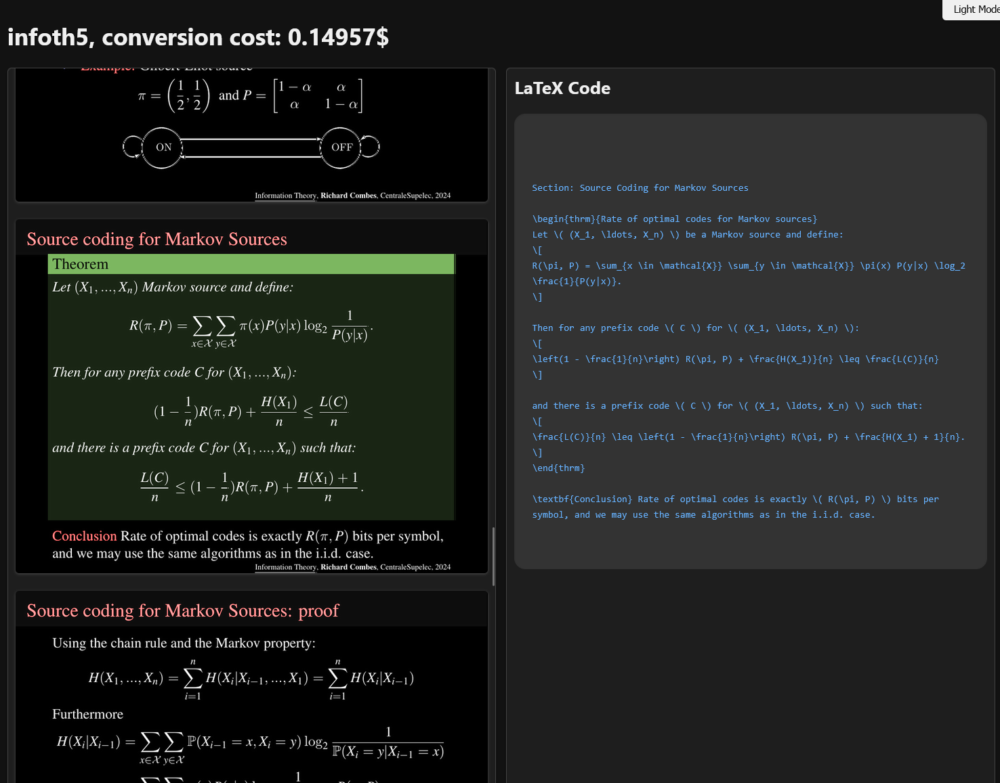

# $\text{Slideto}\TeX$

$\text{Slideto}\TeX$ is a tool that converts PDF presentations to $\LaTeX$ code using advanced Vision-Language Models (VLM). It efficiently extracts mathematical and textual content from slides while reducing processing costs.

<p align="center">

</p>

## Features

- 🧠 Utilization of GPT-4o for accurate image-to-$\LaTeX$ conversion and **custom reformating**
- 🌐 Web interface to visualize and manage converted PDFs
- 💰 Price per page is competitive with services like mathpix (my solution is actually better because it includes automatic and adapted reformating)
- 💡 Intelligent detection of incremental slides to reduce API costs
- 💾 Automatic storage and organization of results
- 🔄 Conversion of PDFs to optimized images

## Why I made this project
For studying, I love creating structured notes in $\LaTeX$. ✍️ It allows me to synthesize information in a clear and organized way. However, manually transcribing all the content from slides is extremely time-consuming. ⏳ $\text{Slideto}\TeX$ saves me valuable time: I can attend lectures with pre-filled notes, complete missing information, add remarks and trim unnecessary parts on the spot. 📝 Additionally, it enables me to adapt the slides to my own $\LaTeX$ formatting style, which enhances both my understanding and retention. 🧠

### Incremental Subsequence Detection

The incremental subsequence detection algorithm is particularly intelligent 🤖 and cost-effective. 💰 By identifying slides that only contain minor additions compared to previous ones, it drastically reduces the number of requests sent to language models (LLMs). This not only lowers API usage costs but also helps reduce the carbon footprint 🌍 associated with these models, which are already highly resource-intensive. ⚡

### An Economical and Flexible Alternative

This project is also economically competitive with services like Mathpix. 💸 In addition to being free and open-source, $\text{Slideto}\TeX$ offers unmatched flexibility through the use of customizable prompts. 🛠️ This allows the extracted content to be tailored to the user's specific $\LaTeX$ commands, making the results even more relevant and suited to my personal needs. 🎯


## Installation

```bash
# Clone the repository
git clone https://github.com/your-name/slidestotex.git
cd slidestotex

# Install dependencies
pip install -r requirements.txt

# Configure API key (optional if already in config.py)
export OPENAI_API_KEY="your-api-key"
```

## Usage

### Configuration

The main parameters are located in `src/config.py`:

- `API_KEY`: OpenAI API key
- `MODEL_NAME`: Model to use (default: gpt-4o)
- `IMAGE_BASE_WIDTH`: Image width for processing
- `CONVERTED_PDFS_DIR`: Results storage directory
### Command Line

Simple conversion of a PDF to $\LaTeX$:

```bash
python -m src.$\text{Slideto}\TeX$ path/to/your/slides.pdf
```

With incremental slide detection (cost saving):

```bash
python -m src.$\text{Slideto}\TeX$ path/to/your/slides.pdf --extract-relevant-slides
```

Using a custom prompt:

```bash
python -m src.$\text{Slideto}\TeX$ path/to/your/slides.pdf --prompt path/to/custom_prompt.txt
```

### Web Interface

Launch the web interface to view processed PDFs:

```bash
python -m src.interface
```

Then open your browser at http://localhost:5000

### Advice for Crafting Great Prompts

To get the most out of this system, consider the following tips:

- **Adaptability**: This tool is very cool because it adapts the content to your needs, exceeding mere feature extraction, if you get really specific into how you want the content to be extracted you can really boost your workflow!
 - **Modularity**: You can actually build different prompt files for different formats (slides, lecture notes, etc...)
- **Flexibility**: You can also ask it to extract anything in any format (LaTeX is just the format that I use).
- **Clarity**: Explicitly describe the desired output format and scope (e.g., LaTeX content between \begin{document} and \end{document}).
- **Specificity**: Detail requirements for handling special environments and formatting instructions.
- **Context**: Include examples or background information to guide the conversion process.
- **Conciseness**: Keep instructions focused and avoid unnecessary complexity.
- **Iterative Improvement**: Test different variations and refine your prompt based on the results.


## How It Works

1. **PDF Conversion**: The PDF is converted to images
2. **Relevant Slide Detection**: The algorithm identifies incremental slides (progressively adding content) and only keeps the last slide of each sequence
3. **AI Processing**: Images are sent to a VLLM (I've set GPT-4o by default) with a specific prompt to extract $\LaTeX$ content
4. **Storage**: Results are saved alongside the original PDF for later reference

## Incremental Slide Detection Techniques

The algorithm uses a comparison based on SSIM (Structural Similarity Index) and difference analysis to determine if a slide is an incremental version of a previous one. This saves on API costs by only processing slides with complete content.

For more details on detection methods, see [`src/experiments.md`](../experiments/readme.md).

## TODO

- Multi-model support: Integrate other VLMs via openrouter
- Batch processing: Enable queuing multiple PDFs.
- Diagram extraction: for easy integration in latex
- Script integration: Example usage: Anki cheatsheets
- Local models: Support offline open-source VLMs.

 ## License

MIT License

Copyright (c) [2025] [Solal Baudoin]

Permission is hereby granted, free of charge, to any person obtaining a copy of this software and associated documentation files (the "Software"), to deal in the Software without restriction, including without limitation the rights to use, copy, modify, merge, publish, distribute, sublicense, and/or sell copies of the Software, and to permit persons to whom the Software is furnished to do so, subject to the following conditions:

The above copyright notice and this permission notice shall be included in all copies or substantial portions of the Software.

THE SOFTWARE IS PROVIDED "AS IS", WITHOUT WARRANTY OF ANY KIND, EXPRESS OR IMPLIED, INCLUDING BUT NOT LIMITED TO THE WARRANTIES OF MERCHANTABILITY, FITNESS FOR A PARTICULAR PURPOSE AND NONINFRINGEMENT. IN NO EVENT SHALL THE AUTHORS OR COPYRIGHT HOLDERS BE LIABLE FOR ANY CLAIM, DAMAGES OR OTHER LIABILITY, WHETHER IN AN ACTION OF CONTRACT, TORT OR OTHERWISE, ARISING FROM, OUT OF OR IN CONNECTION WITH THE SOFTWARE OR THE USE OR OTHER DEALINGS IN THE SOFTWARE.
